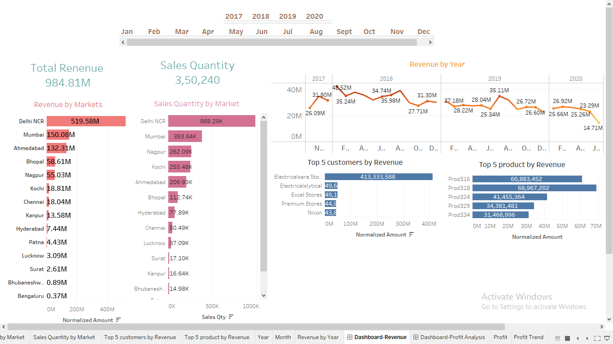

# 📊 Sales Insights Data Analysis Project


A comprehensive business intelligence project that analyzes sales data to identify opportunities, optimize profitability, and provide actionable insights through interactive dashboards.

## 🎯 Project Overview

This project demonstrates end-to-end data analysis using SQL for data extraction and Tableau for visualization. The analysis focuses on sales transactions across multiple markets, currencies, and time periods to help stakeholders make data-driven decisions.

### Business Objectives
- Identify sales opportunities across different markets
- Analyze revenue trends and patterns over time
- Optimize profitability through efficient data analysis
- Provide interactive dashboards for stakeholder decision-making
- Track performance metrics by product, customer, and geography

## 📁 Project Structure

```
Sales-Insights/
├── README.md                  # Project documentation (this file)
├── LICENSE                    # MIT License
├── requirements.txt           # Project dependencies
├── .gitignore                # Git ignore rules
├── data/
│   └── db_dump_version_2.sql # Complete database with sample data
├── dashboards/
│   ├── Sales_insight.twb     # Main Tableau workbook
│   ├── sales_insights.twb    # Alternative Tableau workbook
│   └── Sales_insight.twbx    # Packaged Tableau workbook
├── images/
│   ├── dashboard_overview.png # Main dashboard screenshot
│   └── screenshot_*.png      # Additional dashboard views
└── docs/
    └── sql_queries.md        # Detailed SQL query documentation
```

## 🛠️ Technologies Used

- **Database**: MySQL 8.0+ / MariaDB 10.5+
- **Visualization**: Tableau Desktop / Tableau Public
- **Data Analysis**: SQL (SELECT, JOIN, Aggregations, Filtering)
- **Version Control**: Git & GitHub

## 🚀 Getting Started

### Prerequisites

1. **MySQL or MariaDB** - [Download here](https://dev.mysql.com/downloads/)
2. **Tableau Desktop or Tableau Public** - [Download here](https://www.tableau.com/products/desktop/download)
3. (Optional) Python 3.8+ for additional analysis

### Installation & Setup

#### 1. Clone the Repository
```bash
git clone https://github.com/komal1117/Sales-Insights.git
cd Sales-Insights
```

#### 2. Set Up Database
```bash
# Login to MySQL
mysql -u root -p

# Create database
CREATE DATABASE sales_insights;

# Import the database dump
mysql -u root -p sales_insights < data/db_dump_version_2.sql
```

#### 3. Verify Database Import
```sql
USE sales_insights;
SHOW TABLES;
-- You should see: customers, date, markets, products, transactions
```

#### 4. Open Tableau Dashboard
- Open Tableau Desktop
- Navigate to `dashboards/` folder
- Open `Sales_insight.twbx` (packaged workbook) or `Sales_insight.twb`
- Update data source connection to your local MySQL database
- Refresh the data

## 📊 Database Schema

The database contains the following tables:

| Table Name    | Description                              | Key Columns                          |
|---------------|------------------------------------------|--------------------------------------|
| `customers`   | Customer master data                     | customer_code, customer_name, type   |
| `transactions`| Sales transaction records                | product_code, customer_code, market_code, order_date, sales_qty, sales_amount, currency |
| `products`    | Product information                      | product_code, product_type           |
| `markets`     | Market/location details                  | markets_code, markets_name, zone     |
| `date`        | Date dimension table                     | date, cy_date, year, month_name, date_yy_mmm |

## 📈 Key Analysis & Insights

### Analysis Performed

1. **Customer Analysis**
   - Total customer count and segmentation
   - Customer purchase patterns
   - Top customers by revenue

2. **Market Analysis**
   - Revenue distribution across markets (Chennai, Mumbai, Delhi, etc.)
   - Market-wise product performance
   - Geographic sales trends

3. **Temporal Analysis**
   - Year-over-year revenue comparison (2017-2020)
   - Monthly revenue trends
   - Seasonal patterns in sales

4. **Currency Analysis**
   - Transactions in INR vs USD
   - Currency conversion handling
   - Multi-currency revenue aggregation

5. **Product Analysis**
   - Product-wise sales quantity and revenue
   - Best-performing products
   - Product distribution across markets

### Sample Insights

📍 **Market Performance**: Chennai market (Mark001) contributed significant revenue in 2020
📅 **Temporal Trends**: January 2020 showed specific revenue patterns that informed Q1 strategy
💰 **Revenue Optimization**: Multi-currency tracking enabled accurate profitability analysis

## 🔍 Sample SQL Queries

Here are some key queries used in the analysis:

### Total Revenue in 2020
```sql
SELECT SUM(sales_amount) AS total_revenue_2020
FROM transactions t
INNER JOIN date d ON t.order_date = d.date
WHERE d.year = 2020;
```

### Top 5 Customers by Revenue
```sql
SELECT c.customer_name, SUM(t.sales_amount) AS total_revenue
FROM transactions t
JOIN customers c ON t.customer_code = c.customer_code
GROUP BY c.customer_name
ORDER BY total_revenue DESC
LIMIT 5;
```

For detailed SQL queries and explanations, see [docs/sql_queries.md](docs/sql_queries.md)

## 📸 Dashboard Preview



The interactive Tableau dashboard provides:
- **Revenue Overview**: Total revenue, trends, and KPIs
- **Market Analysis**: Geographic distribution of sales
- **Product Performance**: Top products and categories
- **Time Series**: Monthly and yearly trends
- **Filters**: Interactive filtering by market, product, customer, and date range

*Additional dashboard screenshots are available in the `images/` folder.*

## 🎓 Learning Outcomes

This project demonstrates proficiency in:
- ✅ SQL query optimization and complex joins
- ✅ Data modeling and database design
- ✅ ETL processes and data integrity management
- ✅ Business intelligence dashboard creation
- ✅ Data visualization best practices
- ✅ Stakeholder communication through visual analytics

## 🤝 Contributing

Contributions, issues, and feature requests are welcome! Feel free to check the [issues page](https://github.com/komal1117/Sales-Insights/issues).

### How to Contribute
1. Fork the repository
2. Create your feature branch (`git checkout -b feature/AmazingFeature`)
3. Commit your changes (`git commit -m 'Add some AmazingFeature'`)
4. Push to the branch (`git push origin feature/AmazingFeature`)
5. Open a Pull Request

## 📝 License

This project is licensed under the MIT License - see the [LICENSE](LICENSE) file for details.

## 👤 Author

**komal1117**
- GitHub: [@komal1117](https://github.com/komal1117)

## 🙏 Acknowledgments

- Dataset source: Sales transaction data (2017-2020)
- Tools: MySQL, Tableau Desktop
- Inspired by real-world business intelligence use cases

## 📞 Contact & Support

If you have any questions or need support, please:
- Open an issue in this repository
- Connect via GitHub profile

---

**⭐ If you find this project helpful, please consider giving it a star!**

*Last Updated: December 2024*
